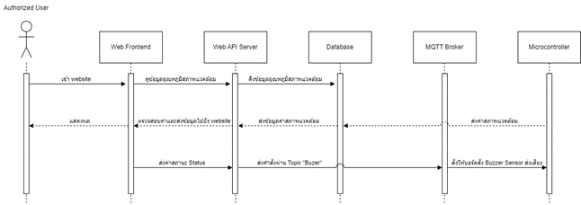

<h1 align="center">ชื่อโครงการ JTM for you health</h1>
 <h2>สมาชิกในกลุ่ม</h2>
    <ul>
        <li>64106107 - ธัมมกิตติ์ โชติช่วง</li>
        <li>64107899 - ปณชัช เอี่ยมน้ำ</li>
        <li>64113889 - ศุภณัฐ คุ้มรักษ์</li>
    </ul>
<h2 align="center">หน้า Website การแสดงผล</h1>
 <p align="center">
        
    </p>
 <h2 align="center">บทนำ</h1>
<p>
ทางกลุ่มผู้จัดทำโครงการได้มองเห็นถึงความสำคัญเรื่องสภาพแวดล้อมและความพึงพอใจของผู้คน ซึ่งเป็นปัจจัยสำคัญที่ส่งผลต่อคุณภาพชีวิตและประสิทธิภาพการทำงาน โดยความเหมาะสมของสภาพแวดล้อมนั้นประกอบไปด้วย อุณหภูมิ ความชื้นภายในอากาศ และที่สำคัญคือ ค่าฝุ่น PM2.5 และ PM10 ที่ส่งผลต่อสภาวะทางเดินหายใจ ซึ่งทางกลุ่มจึงจัดทำอุปกรณ์ที่ตรวจจับค่า อุณหภูมิ ความชื้น และค่าฝุ่น ที่เหมาะสม เพื่อเป็นแนวทางในการป้องกันหากเกิดเหตุการณ์ที่ค่าดังกล่าวผิดปกติ เพื่อเพิ่มความเป็นอยู่ให้ดีขึ้นกับผู้ใช้งานที่กำลังดำเนินกิจกรรมในขณะนั้น
</p>
<p>
    เนื่องด้วยปัจจุบัน สภาพแวดล้อมหรือสภาพอากาศนั้นมีความแปรปรวนเป็นอย่างมากซึ่งส่งผลเสียให้คนที่เป็นโรคภูมิแพ้หรือคนปกติเกิดสภาวะติดขัดทางเดินหายใจ หรือหายใจไม่สะดวก และรุนแรงถึงขั้นหายใจไม่ได้ และเพียงแค่ค่าอุณภูมิที่แสดงอยู่บนแอปพลิเคชันในปัจจุบันนั้นก็ไม่เพียงพอที่จะบอกได้ว่าสภาพแวดล้อมที่ผู้ใช้งานอยู่นั้นเหมาะสมหรือไม่เหมาะสม ซึ่งจากปัญหาเหล่านี้ทางกลุ่มผู้จัดทำจึงมุ่งเน้นในการผลิตอุปกรณ์ IoT ที่สามารถตรวจจับค่าอุณหภูมิ ความชื้น และค่าฝุ่น โดยนำค่าอุณหภูมิและความชื้นมาคำควณค่าดัชณีความร้อน เพื่อเป็นตัวช่วยในการรับมือกับสถานการณ์ที่จะเกิดขึ้นกับอุณหภูมิที่ผู้ใช้รับรู้ได้จริง ณ ขณะนั้น
</p>
<p>
    กลุ่มเราจึงมุ่งเน้นในการทำอุปกรณ์ IoT เพื่อตรวจจับค่าจากสิ่งแวดล้อมได้แก่ ค่าอุณภูมิ ความชื้น ค่าฝุ่นPM2.5 และ PM10 โดยจะแสดงผลขึ้นเว็บไซต์เพื่อบอกคุณภาพสภาพอากาศ ณ ขณะนั้นว่ามีผลเป็น ปกติ แย่ และแย่มาก ซึ่งจะมีการแจ้งเตือนด้วยเสียงผ่านอุปกรณ์ IoT เพื่อจะให้ผู้ใช้งานรับรู้ถึงสถาพอากาศที่ไม่เหมาะสม ณ ขณะนั้น ซึ่งสามารถช่วยการตัดสินใจในการแก้ปัญหาเรื่องสภาพแวดล้อมด้วยตัวเอง
</p>
<p>
 สิ่งที่เรามุ่งเน้นคือการนำเทคโนโลยี IoT ที่มีอยู่มาใช้ในการตรวจจับค่าอุณหภูมิ ความชื้น มาคำนวณค่าดัชนีความร้อน และค่าฝุ่นที่มีอยู่ในสภาพแวดล้อมนั้นมาประมวลผล และแสดงผลค่าความเหมาะสมของสภาพภูมิอากาศว่าอยู่ในเกณฑ์อะไร เพื่อให้ผู้ใช้งานสามารถรับมือกับสถานการณ์ที่สภาพแวดล้อมนั้นเริ่มเปลี่ยนแปลงและส่งผลเสียต่อตัวผู้ใช้งานเอง ดังนั้นโครงงานของเราจึงเป็นตัวช่วยในการตัดสินใจในการรับมือกับสภานการณ์ที่สภาพแวดล้อมนั้นมีแนวโน้มที่ส่งผลเสียให้กับผู้ใช้งาน
</p>
 <h2 align="center">การออกแบบระบบ</h1>
  <p align="center">
        
    </p>
<p>จากสถาปัตยกรรมระบบนี้ เป็นสถาปัตยกรรมของระบบ JTM ที่แบ่งเป็น 3 โมดูลดังนี้	</p>
<p>โมดูลที่ 1 คือ Microcontroller & Sensors เป็นโมดูลที่เกี่ยวกับอุปกรณ์ด้าน Hardware ต่าง ๆ โดยส่วนของ ATmega32P นั้นจะทำหน้าที่ในการเก็บค่าข้อมูลที่ได้จาก Sensor DH11, Sensor SDS011 และทำการเช็คค่า Status หากมีค่าดัชนีความร้อนหรือ PM2.5 ที่อยู่ในเกณ์เฝ้าระวังหรืออันตราย จากนั้นจะส่งค่าไปยัง ESP8266 ที่จะแสดงสถานะส่งข้อมูลผ่าน LED ว่าสามารถอ่านข้อมูลจาก ATmega32P และส่งข้อมูลเข้า json server ได้หรือไม่</p>
<p>โมดูลที่ 2 คือ Backend เป็นโมดูลที่เกี่ยวกับการประสานงานการรับส่งข้อความระหว่างไคลเอนต์ต่างๆ โดยประกอบด้วยส่วนของ Json server ทำหน้าที่ในการรับและกรองข้อความจาก Microcontroller เพื่อใช้ในการติดต่อระหว่างโมดูลและจัดเก็บข้อมูล จากนั้น Flask server จะทำหน้าที่ในการเรียกใช้ API จาก Json Server เพื่อทำหน้าที่เป็นตัวติดต่อระหว่าง Json server และ Frontend</p>
<p>โมดูลที่ 3 คือ Frontend เป็นโมดูลที่เกี่ยวกับการแสดงผลข้อมูล สถานะต่าง ๆ ของค่าที่ได้รับมาจาก Sensor จะทำหนน้าที่เป็นส่วนของการแสดงผลซึ่งในส่วนนี้จะเป็นการแสดงผลข้อมูลที่ได้รับมาในส่วนของ Json Server ประกอบไปด้วย ค่าอุณภูมิ ค่าความชื้น ค่าดัชนีความร้อน ค่าฝุ่น PM2.5 PM10 Timestamp และคุณภาพอากาศแบบ Realtime ทุกๆ 5 วินาที นอกจากนี้จะมีการส่งค่าคุณภาพอากาศกลับไปยังบอร์ด เพื่อแจ้งเตือนคุณภาพอากาศ Warning และ Uncomfortable</p>
<h2 align="center">สถาปัตยกรรมซอฟต์แวร์</h1>
  <p align="center">
        
    </p>
<p>Module สำหรับการใช้งานผ่าน Web Frontend โดยผู้ใช้จะต้องทำงานเข้าใช้งาน Website ก่อนจากนั้นระบบจะทำการดึงค่าจาก Web API Server มาแสดงผลผลบนหน้า Website โดยจะมีการอับเดตค่าสภานะและสภาพแวดล้อมทุกๆ 5 วินาที</p>
<p>ระบบจะส่งค่า Status จาก Website ไปประตูผ่าน MQTT Broker ไปยัง Microcontroller ซึ่งจะสั่งให้ Buzzer Sensor ทำงานเพื่อส่งเสียงบ่งบอกถึงระดับความอันตรายในสภาพแวดล้อมนั้น โดย Module นี้ประกอบด้วย 5 องค์ประกอบหลัก ได้แก่ </p>
    <ul>
        <li>Authorized User: ผู้ใช้งานระบบ</li>
        <li>Web Frontend : หน้าเว็บไซต์สำหรับแสดงค่าสถานะและสภาพแวดล้อม</li>
        <li>Web API Server : บริการ API สำหรับ Web Frontend ในการรับ-ส่งข้อมูล</li>
        <li>Database : ฐานข้อมูลสำหรับเก็บข้อมูลสภาพแวดล้อมล</li>
        <li>MQTT Broker : ตัวกลางสำหรับรับส่งข้อมูลสถานะระหว่าง Web API Server และ Microcontroller </li>
    </ul>
<h2 align="center">โครงสร้างข้อมูล</h1>
<p>ข้อมูลที่รับจากเซนเซอร์ต่าง ๆ จะถูกจัดเก็บในรูปแบบโครงสร้างของ Json ที่จะประกอบไปด้วยข้อมูลของ Temperature, Humidity, HeatIndex, PM2.5, PM10, Status, timestamp และ id ตามลำดับ ที่ถูกจัดเก็บใน Module ชื่อ ESP8266</p>

```
{
  "ESP8266": [
    {
      "Temp": 23.29999924,
      "Humid": 95,
      "HeatIndex": 24.17000008,
      "PM25": 5.400000095,
      "PM10": 8.699999809,
      "Status": "Comfortable",
      "timestamp": "23-12-2023 23:49:19",
      "id": 1
    }
}
```
<h2 align="center">โครงสร้างข้อมูล</h1>
<table style="border: red solid 1px;">
    <tr>
        <th>Attribute Name</th>
        <th>Description</th>
        <th>Data Type</th>
        <th>Example</th>
    </tr>
    <tr>
        <td>id</td>
        <td>id ของข้อมูลที่นำเข้า</td>
        <td>Int</td>
        <td>1</td>
    </tr>
    <tr>
        <td>Timestamp</td>
        <td>เวลาที่นำเข้าข้อมูล</td>
        <td>timestamp</td>
        <td>12-12-2023 20:32:11</td>
    </tr>
    <tr>
        <td>Temp</td>
        <td>ค่าของอุณหภูมิ</td>
        <td>float</td>
        <td>24.02</td>
    </tr>
    <tr>
        <td>Humid</td>
        <td>ค่าของความชื้น</td>
        <td>float</td>
        <td>62.00</td>
    </tr>
    <tr>
        <td>HeatIndex</td>
        <td>ค่าของอุณหภูมิจากมนุษย์</td>
        <td>float</td>
        <td>24.06</td>
    </tr>
    <tr>
        <td>PM2.5</td>
        <td>ค่าของฝุ่นขนาดไม่เกิน 2.5 ไมครอน</td>
        <td>float</td>
        <td>12.80</td>
    </tr>
    <tr>
        <td>PM10</td>
        <td>ค่าของฝุ่นขนาดไม่เกิน 10 ไมครอน</td>
        <td>float</td>
        <td>14.39</td>
    </tr>
    <tr>
        <td>Status</td>
        <td>ค่าที่บ่งบอกถึงคุณภาพอากาศ ณ ปัจจุบัน</td>
        <td>String</td>
        <td>Comfortable</td>
    </tr>
</table>
